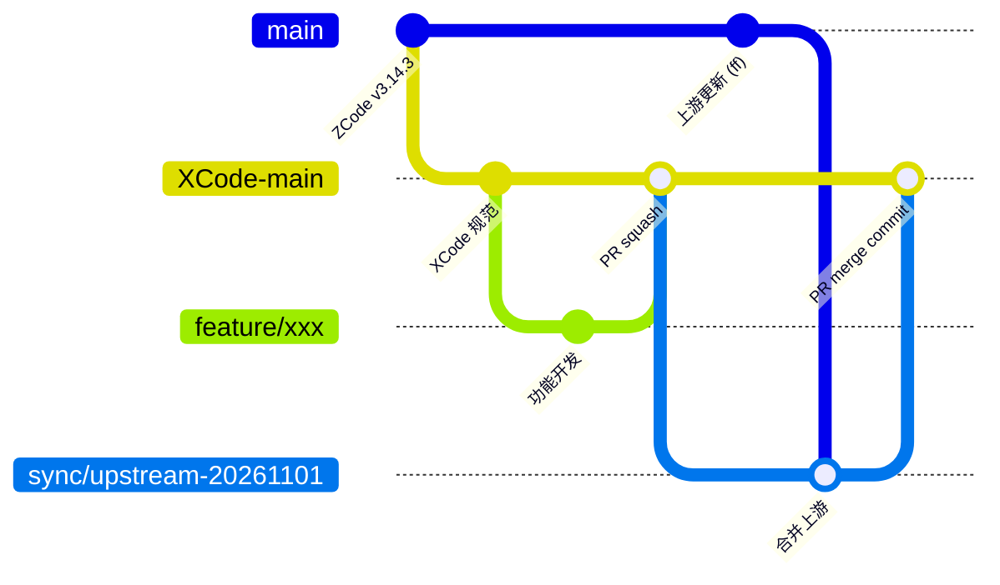

# XCode 分支与上游同步规范

XCode 是基于智谱开源项目 [zai-org/ZCode](https://github.com/zai-org/ZCode) 的下游产品。本规范所有开发者（含 AI Agent）都必须遵守。

## 1. 远端约定

| 远端       | 地址                                 | 用途             |
| ---------- | ------------------------------------ | ---------------- |
| `origin`   | `git@github.com:978655242/XCode.git` | XCode 产品仓库   |
| `upstream` | `git@github.com:zai-org/ZCode.git`   | ZCode 上游，只读 |

首次克隆后执行：

```bash
git remote add upstream git@github.com:zai-org/ZCode.git
git remote set-url --push upstream DISABLED   # 防止误推上游
git fetch upstream --tags
```

## 2. 分支模型



| 分支                       | 来源            | 规则                                                                          |
| -------------------------- | --------------- | ----------------------------------------------------------------------------- |
| `main`                     | `upstream/main` | 上游纯镜像。只允许 fast-forward 到 `upstream/main`，禁止提交任何 XCode 改动。 |
| `XCode-main`               | —               | XCode 产品主干，GitHub 默认分支。禁止直接 push，只接受 PR。                   |
| `feature/<简述>`           | `XCode-main`    | 新功能。                                                                      |
| `fix/<简述>`               | `XCode-main`    | 缺陷修复。                                                                    |
| `hotfix/<版本>-<简述>`     | 发布 tag        | 线上紧急修复，合回 `XCode-main`。                                             |
| `sync/upstream-<YYYYMMDD>` | `XCode-main`    | 上游同步专用，见第 4 节。                                                     |

规则：

- 所有开发分支从最新的 `XCode-main` 切出，PR 目标必须是 `XCode-main`，禁止向 `main` 提 PR。
- 小步提交、短生命周期；分支落后 `XCode-main` 时用 `git rebase origin/XCode-main` 更新（仅限个人未共享分支）。
- 上游的其他分支（如 `upstream/feat/ui-plugin`）不直接合入；等其进入 `upstream/main` 后随常规同步进入。确需提前引入时走 `sync/` 流程并在同步记录中注明。

## 3. 提交与 PR

- 提交信息使用 Conventional Commits：`feat:`、`fix:`、`refactor:`、`docs:`、`chore:`、`sync:`（仅同步分支）。
- `feature/`、`fix/` 的 PR 使用 Squash merge。
- `sync/` 的 PR 必须使用 Create a merge commit，禁止 Squash 与 Rebase。原因：保留上游提交的原始 SHA，下次同步时 Git 才能正确计算 merge-base，否则同一批上游改动会反复冲突。
- PR 合并前必须通过 `pnpm typecheck`、`pnpm lint`、`pnpm verify:pre-push`，并按 PR 模板填写检查项。

## 4. 上游同步流程

同步分两步：先把上游镜像到 `main`，再评审差异并合入 `XCode-main`。建议每两周或上游发布新版本时执行一次。

### 4.1 更新 `main` 镜像

```bash
git fetch upstream --tags
git switch main
git merge --ff-only upstream/main   # 失败说明 main 被污染，停止并排查，禁止强推覆盖
git push origin main --follow-tags
```

也可使用 `gh repo sync 978655242/XCode -b main`。

### 4.2 评审上游差异

```bash
# 尚未进入 XCode-main 的上游提交
git log --oneline --no-merges XCode-main..main

# 上游自上次同步以来改了哪些文件（三点 diff，基于 merge-base）
git diff --stat XCode-main...main

# XCode 相对上游改了哪些文件（预估冲突面）
git diff --stat main...XCode-main

# 两边都改过的文件 = 高冲突风险
comm -12 <(git diff --name-only XCode-main...main | sort) \
         <(git diff --name-only main...XCode-main | sort)
```

逐个提交分类，结果写入 [`upstream-sync-log.md`](./upstream-sync-log.md)：

| 分类 | 判断标准                                       | 处理                          |
| ---- | ---------------------------------------------- | ----------------------------- |
| 采纳 | Bug 修复、安全修复、性能、依赖升级、通用新功能 | 随合并进入                    |
| 适配 | 有价值但与 XCode 定制冲突                      | 合并后在同步分支内改造        |
| 拒绝 | 与 XCode 产品方向冲突、或依赖 ZCode 专有服务   | 合并后 `git revert`，记录原因 |

安全修复一律采纳，不得以“暂不需要”为由拒绝。

### 4.3 合入 `XCode-main`

```bash
git switch XCode-main && git pull --ff-only
git switch -c sync/upstream-$(date +%Y%m%d)
git merge --no-ff main -m "sync: merge upstream ZCode <上游版本或短 SHA>"
# 解决冲突；对“拒绝”的上游提交执行 git revert <sha>，每个 revert 单独提交
pnpm install && pnpm typecheck && pnpm lint && pnpm verify:pre-push
git push -u origin HEAD
gh pr create --base XCode-main --title "sync: upstream ZCode <版本>"
```

要求：

- 默认整体 merge `main`，不要从上游 cherry-pick。cherry-pick 会生成新 SHA，下次 merge 时同一改动会再次冲突。只有紧急安全修复来不及完整同步时才允许 cherry-pick（`git cherry-pick -x`），并在同步记录中登记，下次完整同步时核对。
- 冲突解决必须说明取舍：保留 XCode 行为、采用上游行为或二者融合。不确定时在 PR 中 @ 相关功能负责人。
- 同步 PR 只包含上游合并、冲突解决、拒绝项 revert 和必要适配，禁止夹带新功能。
- 合并后更新 `upstream-sync-log.md` 中的“已同步到”字段。

## 5. 降低与上游的分叉成本

后续同步的成本取决于 XCode 改了多少上游文件。开发时必须：

- XCode 专属功能优先放在新文件、新模块或新包中，通过上游已有的扩展点（依赖注入、插件、配置）接入，不直接改写上游核心文件。
- 必须修改上游文件时，改动保持最小，并在改动处加注释 `// XCODE: <原因>`，便于同步时识别。
- 禁止对上游文件做与功能无关的格式化、重命名、目录调整。
- 品牌名称、图标、域名、服务地址等差异集中到配置或资源文件，不在业务代码中散落替换。
- 修复 bug 前先确认上游是否已修复（`git log main --grep=<关键词>`）。通用 bug 建议同时向上游 ZCode 提 PR，合入后随同步获得，减少长期分叉。

## 6. 版本与 Tag

- 上游 tag（如 `v3.14.3`）保持原样，不删除、不重写。
- XCode 发布 tag 使用 `xcode-v<主>.<次>.<修订>`，只在 `XCode-main` 上打，避免与上游 tag 冲突。

## 7. 禁止事项

- 禁止向 `main` 提交或合并任何 XCode 代码；禁止 force push `main` 与 `XCode-main`。
- 禁止向 `upstream` 推送。
- 禁止 Squash 或 Rebase 方式合并 `sync/` PR。
- 禁止在一个 PR 中同时包含上游同步与功能开发。
