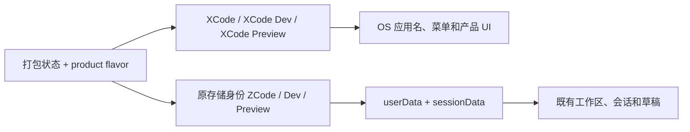

# XCode 图标与显示名

采用用户确认的断笔几何 X：保留 ZCode 图标的黑色渐变圆角底板、白色粗斜笔、原有字标外接矩形与留白。右上到左下为完整主笔，另一斜笔在交叉位置断开，切口与主笔平行。不修改供应商 ZAI/BigModel 标志。

品牌资源为唯一视觉来源；桌面 PNG/ICNS/ICO、Linux 多尺寸 PNG、Web favicon 和公共品牌图标同步更新。安装器保留黑色包装盒，仅替换盒面字标；DMG 背景组合字标首字母改为 X，保留背景与 CODE 字形。UI 关于页、独立桌面 About 窗口、启动页、字标组合与草稿首页浅色/深色装饰图均使用断笔 X，保留尺寸、主题颜色与动画。产品显示名遵守下方统一规则。

验收：1024px 与 16/32px 均可辨识 X；透明边缘与原底板保留；各平台图标解码有效；启动页、桌面独立 About 窗口及首页两种主题不再显示 Z 字标。macOS 开发 .app 内的 CFBundleIconFile 指向当前产品 ICNS，缓存命中时仍同步图标，不因 Electron 二进制未变化而保留旧图标；不修改 node_modules。

按用户要求，首页装饰 X 恢复背景式展示：使用原有绝对定位、`min(72vw,25rem)` 尺寸和浅色向下渐隐遮罩；深色恢复原渐变描边与柔和填充。不再为图形增加文档流高度，不改变问候语与输入框原有位置。下半部淡出是此样式的预期效果；X 品牌路径及其他图标替换保持不变。

## 产品显示名

产品对用户显示的名称统一为 `XCode`，变体为 `XCode Preview`、`XCode Dev`、`XCode Desktop App`。适用范围包括所有语言文案、按钮与菜单、输入框提示、可访问性标签、页面/窗口标题、通知和错误提示、原生授权提示、安装器与应用展示名、运行时 Agent/CLI 提示和产品介绍。复用既有语言资源与产品身份配置，不通过运行时全局字符串替换覆盖外部内容。

本次仅迁移展示层：保留内部 `@zcode/*` 包名、导出符号、协议字段、请求来源身份、URL scheme、环境变量、数据库/目录 key、持久化分段标记、应用 ID、CLI 命令和服务端地址。用户项目/工作区名称、会话内容及历史数据不改写。历史错误文案只用于识别既有会话/远端错误，不再生成旧产品文案。上游来源 URL、法律归属和供应商 ZAI/BigModel 名称不属于本产品显示名，不伪造来源或归属。

验收：桌面应用/菜单/About、首页输入框、设置与引导、Web 标题和分享页面、通知/授权、安装器、CLI 帮助与运行时文案不再将产品称为 ZCode；中英文均为 XCode。实际启动和历史工作区恢复正常，已有草稿不丢失。

桌面展示身份与存储身份由 `desktopRuntimeEnv.ts` 统一派生。`app.setName` / `process.title` 使用 XCode 变体；`runtimeUserDataPath` / `runtimeSessionDataPath` 继续使用原数据身份，显式测试覆盖保持既有语义：

## 生成与验证

生成脚本：`scripts/xcode/generate-icons.py`（Python + Pillow）。从仓库根目录执行，复用现有底板并导出平台资源。

完整复查验证：31 个 PNG/ICO/ICNS 文件成功解码；真实桌面通过“帮助 → 关于 ZCode”打开独立 About 窗口，已截图确认 X；首页浅色已截图，临时切换 DOM 主题类确认深色 X 并恢复原主题，未修改用户主题设置。开发 .app 的 `CFBundleIconFile` 为 `xcode.icns`，文件 SHA-256 与产品 ICNS 一致。`pnpm typecheck` 通过；`pnpm lint` 为 0 错误、70 条警告；`pnpm architecture:check --changed` 为 0 违规。Windows/Linux 安装包未实际运行。

上一轮只验证了启动壳，漏掉了 `aboutWindow.ts` 内联 SVG、草稿首页两套独立 Z 图形与未接入产品 ICNS 的 macOS 开发 .app。该遗漏不能归因于缓存。必须在真实桌面 About 窗口和首页验证；正式安装包仍需另行构建验证。

首页样式还原验证：真实桌面热更新后确认图形为绝对定位、当前宽度 400px，浅色遮罩恢复在 70% 处完全透明；截图确认问候语和输入框回到原布局。类型检查通过，Lint 为 70 条警告、0 错误，架构检查为 0 违规。

## 显示名迁移验证

- `pnpm typecheck` 通过；`pnpm lint` 为 0 错误、70 条已有警告；`pnpm architecture:check --changed` 为 0 违规。
- `pnpm --filter @zcode/cli... build` 构建完整 CLI 及依赖成功；桌面启动再构建并暂存 desktop-agent，随后恢复完整 CLI 构建产物。Node 24.18.0 与 CLI 声明的精确 24.14.0 存在 engine 警告，构建成功。
- 已重启真实桌面。页面标题为 XCode；“帮助 → 关于 XCode”打开原生 About，截图确认 `XCode Desktop App` 与 `版权所有 © 2026 XCode`。开发 .app 的 `CFBundleDisplayName` 和 `CFBundleName` 均为 `XCode Dev`，bundle ID 仍为 `dev.zcode.app.development`。
- 既有 ZCode/lago-lianlian 项目与会话仍可见，项目名未改写。验证期间原草稿界面已转入 PPT 会话，原提示前缀可见；未将备份草稿覆盖到当前输入框，未声称逐字草稿恢复已经验证，未发送用户 prompt。
- 中英文 CLI `--help` 实际输出 XCode；真实 TUI 启动页显示 XCODE ASCII 字标与 `Starting XCode...`，通过 Ctrl+C 中断验证进程（子进程退出码 130），未发送模型请求；未声称完整 TUI 启动流程和正常退出已经验证。
- 真实 Chrome 390×844 Web 页面标题为 `XCode - Web + Server`，截图与可访问性标签确认输入框提示为“向 XCode 提问”。已关闭独立 Web 验证前端/浏览器并删除临时 profile，保留用户桌面运行。
- 正式 macOS、Windows、Linux 安装包未构建运行，仅执行产品身份配置确认正式/Preview 显示名为 XCode/XCode Preview，app ID 与 Linux 命令名不变。辅助命令 `doctor-macos-release-app.sh --help` 在既有 help 分支前执行 `basename --help`，报非法选项；本次未扩展范围修复该问题。
