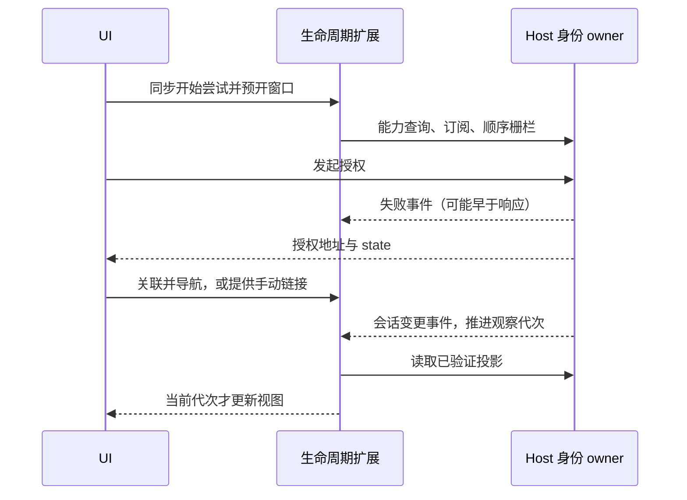

# 本机 Web OAuth UI 生命周期

本模块由本机 Web 平台装配，管理临时授权窗口、当前尝试关联及 Renderer 观察代次；Host 的 OAuth 服务是唯一身份 owner。未装配时使用既有 UI 逻辑。

```mermaid
sequenceDiagram
  participant U as UI
  participant E as 生命周期扩展
  participant H as Host 身份 owner
  U->>E: 同步开始尝试并预开窗口
  E->>H: 能力查询、订阅、顺序栅栏
  U->>H: 发起授权
  H-->>E: 失败事件（可能早于响应）
  H-->>U: 授权地址与 state
  U->>E: 关联并导航，或提供手动链接
  H-->>E: 会话变更事件，推进观察代次
  E->>H: 读取已验证投影
  E-->>U: 当前代次才更新视图
```

启动恢复与设置观察从同一实例捕获代次；卸载令全部未完成结果失效。扩展不保存账号或凭据，不重新实现 Host 登录状态机。
